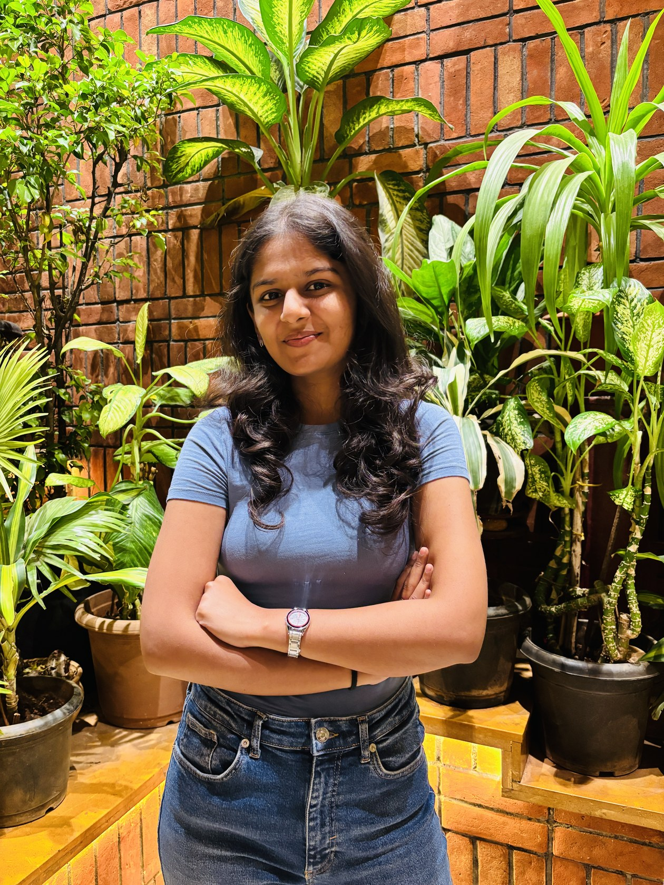

# Nidhi Patil — Portfolio Website

Plain HTML + CSS + JS. No build tools, no installs. Open the file and it works.

---

## How to preview locally

1. Open the `nidhi-portfolio` folder in VS Code
2. Install the **Live Server** extension (one-time, free)
3. Right-click `index.html` → **Open with Live Server**
4. Done — it opens in your browser at `localhost:5500`

That's it. Every time you save a file, the browser refreshes automatically.

---

## Folder structure

```
nidhi-portfolio/
├── index.html              ← Homepage
├── css/
│   └── style.css           ← All styles
├── js/
│   └── main.js             ← All interactions
├── assets/
│   ├── images/             ← Put all your photos here
│   └── projects/           ← Put project cover images here
└── pages/
    ├── anthozoa.html       ← Anthozoa case study
    ├── reviving-heritage.html
    ├── wedriti.html
    └── resume.html
```

---

## Replacing placeholder content

### Your logo
Open `index.html` (and each page in `pages/`).
Find the `<svg class="logo-svg" ...>` block inside `.nav-logo`.
Replace the whole SVG with an `` tag pointing to your logo file:

```html

```

### Your photo (About section)
In `index.html`, find `.about-photo-placeholder` and replace with:

```html

```

### Project cover images
In `index.html`, find each `.project-card-placeholder` div and replace with:

```html

```

Do the same in each case study page for the `.cs-cover-placeholder` div:

```html

```

Note: in `pages/` subfolder, the path starts with `../` (go up one level first).

### Arc carousel cards (Life beyond design)
In `index.html`, find each `.arc-placeholder` div and replace with:

```html

```

### Your resume
Upload your PDF to `assets/nidhi-resume.pdf`, then in `pages/resume.html` replace the coming-soon block with:

```html
<iframe src="../assets/nidhi-resume.pdf" width="100%" height="800px" style="border:none;border-radius:8px;"></iframe>
```

---

## How to publish on GitHub Pages (free, anyone can access the link)

1. Create a free account at [github.com](https://github.com) if you don't have one
2. Click **New repository** → name it `portfolio` → set to **Public** → click **Create**
3. Upload all files: click **Add file → Upload files** → drag your entire `nidhi-portfolio` folder contents (not the folder itself, just what's inside)
4. Click **Commit changes**
5. Go to **Settings → Pages** (left sidebar)
6. Under **Source**, select **Deploy from a branch** → Branch: `main` → Folder: `/ (root)` → **Save**
7. Wait ~1 minute → your site is live at:

```
https://YOUR-GITHUB-USERNAME.github.io/portfolio/
```

### Adding a new project later

1. Create a new file in `pages/` (copy `wedriti.html` as a template)
2. Add a new `.project-card` block in `index.html`
3. Upload, commit — live within seconds

---

## Fonts used

- **Domine** (headings) — Google Fonts
- **Space Grotesk** (body, nav, labels) — Google Fonts

Both load automatically from Google Fonts. No install needed.

## Colors

| Name    | Hex       | Used for                     |
|---------|-----------|------------------------------|
| Black   | `#1F1F1F` | Text, headings, nav          |
| White   | `#FFFFFF` | Background                   |
| Red     | `#D42222` | Typing word 1, accents       |
| Blue    | `#6B7FD4` | Cursor dot, typing word 2, labels |
| Green   | `#14A62A` | Typing word 3                |
| Grey    | `#888888` | Labels, borders              |
